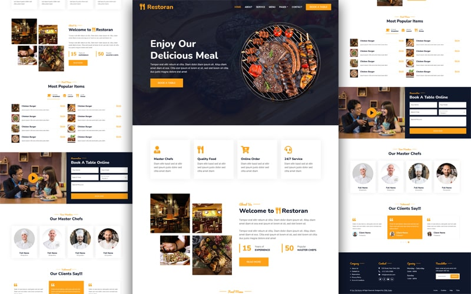

# 🍽️ Utami Food - Website Resmi



Selamat datang di repositori website resmi **Utami Food**! 
Website ini berfungsi sebagai *landing page* dan katalog digital untuk usaha kuliner Utami Food, spesialis **Nasi Bakar** dan **Ceker Mbeledos**.

---

## 🌟 Fitur Utama

| Fitur | Deskripsi |
|-------|-----------|
| 📋 **Katalog Menu Interaktif** | Menampilkan menu andalan (Nasi Bakar berbagai varian), Pelengkap, dan Minuman beserta harganya |
| 🛒 **Sistem Pre-Order** | Form terintegrasi untuk pelanggan melakukan pemesanan lengkap dengan pilihan jumlah porsi |
| ⭐ **Testimoni Pelanggan** | Menampilkan ulasan positif dari pelanggan setia dalam carousel interaktif |
| 👨‍🍳 **Profil Koki** | Memperkenalkan Master Chef di balik lezatnya hidangan (Utami & Monik) |
| 📱 **Desain Responsif** | Tampilan dioptimalkan untuk mobile, tablet, maupun desktop |
| 💬 **WhatsApp Integration** | Tombol WhatsApp floating untuk kemudahan pemesanan langsung |
| 🎨 **Animasi Modern** | Smooth scroll, custom scrollbar, dan micro-animations |

## 📖 Menu Andalan

### 🔥 Nasi Bakar
- Nasi Bakar Ayam - Rp 15.000
- Nasi Bakar Sapi - Rp 18.000
- Nasi Bakar Ati - Rp 15.000
- Nasi Bakar Kulit - Rp 10.000

### 🌶️ Menu Spesial
- Ceker Mbeledos (Level 1-5) - Rp 15.000

### 🥤 Pelengkap & Minuman
- Tempe Bacem, Tahu Bacem, Sate Ati, Sate Kulit, Krupuk, Agar-agar
- Es Teh/Panas, Jus Jeruk, Air Putih

## 🛠️ Teknologi yang Digunakan
- **HTML5** & **CSS3** - Struktur dan styling modern
- **Bootstrap 5** - Framework CSS responsive
- **JavaScript** & **jQuery** - Interaktivitas dan animasi
- **Font Awesome** & **Bootstrap Icons** - Ikon vektor
- **Animate.css** & **WOW.js** - Scroll-based animations
- **OwlCarousel** - Slider testimoni

## 🎨 Fitur CSS Custom
- ✅ Smooth scroll behavior
- ✅ Custom scrollbar dengan warna brand
- ✅ Promo badge dengan pulse animation
- ✅ WhatsApp floating button
- ✅ Hover effects pada service cards

## 🚀 Cara Menjalankan Secara Lokal
1. *Clone* repositori ini:
   ```bash
   git clone https://github.com/gwennstacy969-dotcom/utami-food-website.git
   ```
2. Buka folder proyek:
   ```bash
   cd utami-food-website
   ```
3. Buka `index.html` di browser Anda, atau gunakan Live Server extension di VS Code.

## 📂 Struktur Proyek
```
utami-food-website/
├── index.html          # Halaman utama
├── about.html          # Halaman tentang kami
├── menu.html           # Halaman menu lengkap
├── booking.html        # Halaman pemesanan
├── service.html        # Halaman layanan
├── team.html           # Halaman tim koki
├── contact.html        # Halaman kontak
├── testimonial.html    # Halaman testimoni
├── css/
│   ├── bootstrap.min.css
│   └── style.css       # Custom styles
├── js/
│   └── main.js         # Custom JavaScript
├── img/                # Gambar dan aset visual
├── lib/                # Library pihak ketiga
└── scss/               # Source SCSS files
```

## 📝 Changelog Terbaru
- ✨ Tambah meta tags SEO dan Open Graph
- 🌐 Terjemahan konten ke Bahasa Indonesia
- 🎨 Custom scrollbar dan smooth scroll
- 💬 WhatsApp floating button
- 📱 Perbaikan responsivitas
- 🔧 Dynamic copyright year

---

*Dibuat dengan ❤️ untuk kemajuan usaha kuliner Utami Food.*
